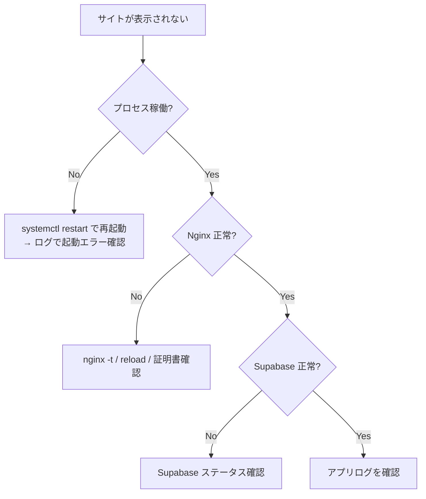

# momo-payment 運用マニュアル

**対象バージョン**: 本番リリース版（Next.js 15 / App Router）
**最終更新**: 2026-06-16
**対象読者**: サイト運用担当者（店舗スタッフ）／システム保守担当者

---

## 1. このマニュアルについて

本書は「もも娘」オンライン注文システム（momo-payment）の **日常運用・保守・障害対応** を記述します。
役割に応じて以下を参照してください。

- **店舗スタッフ（非エンジニア）**: 「3. 日常運用業務」を中心に。
- **システム保守担当（エンジニア）**: 「4. 監視」以降を中心に。

構築・デプロイ手順は `docs/DEPLOYMENT_SELF_HOSTED.md`、システム全体像は `docs/SYSTEM_ARCHITECTURE.md` を参照してください。

---

## 2. システム概要（運用観点）

| 項目 | 内容 |
|-----|------|
| 公開サイト | `https://taiwanyoichi-momomusume.com`（`/ja`・`/zh-tw`） |
| 管理画面 | `https://<ドメイン>/admin`（管理者ログイン必須） |
| 購入体験 | 配送 EC（冷凍食品・グッズのオンライン配送、Stripe 決済必須） |
| 主要外部サービス | Supabase（DB/認証/画像）・Stripe（決済）・Resend（メール）・Google Calendar（夜市カレンダー） |
| 重要ルール | 冷凍（FROZEN）とグッズ（AMBIENT）の**温度帯混在購入は不可**／配送はオンライン決済必須 |

### 連絡先・管理コンソール（運用開始時に記入）

| 対象 | URL / 連絡先 | 担当 |
|-----|------------|------|
| サーバー（自社） | ___ | ___ |
| Supabase ダッシュボード | https://supabase.com/dashboard | ___ |
| Stripe ダッシュボード | https://dashboard.stripe.com | ___ |
| Resend ダッシュボード | https://resend.com | ___ |
| ドメイン / DNS | ___ | ___ |
| 一次対応エスカレーション先 | ___ | ___ |

---

## 3. 日常運用業務（管理画面）

管理画面 `/admin` にログインして行う通常業務です。

### 3.1 商品管理（`/admin/products`）

- **新規登録 / 編集 / 削除**（CRUD）。
- 商品種別（冷凍食品 / グッズ）、温度帯、価格、バリエーション（`product_variants`）、在庫、画像、食品表示（`food_label`）、日本語/繁体字の多言語項目を設定。
- 画像は Supabase Storage（`product-images` バケット）にアップロードされます（1枚 5MB 上限・jpeg/png/webp/gif）。
- 並び順は並び替え機能（`products_reorder` RPC）で調整。

> **本番DBの削除方針**: 商品やデータの**物理削除は原則行わない**運用です。販売停止は「非公開化」や在庫 0 で対応し、削除が必要な場合はバックアップ取得後に慎重に実施してください。

### 3.2 注文管理（`/admin/orders`）

- 注文一覧・詳細を確認。ステータス、顧客情報、明細、配送先を表示。
- **発送登録**: 「発送登録（ship）」で配送業者・追跡番号を入力 → `SHIPPED` に更新 → 顧客へ発送通知メールが自動送信。
- **返金**: 必要に応じて注文詳細の「返金（refund）」で Stripe 返金処理 → `REFUNDED` に更新。

#### ステータスの見方

| ステータス | 意味 | 次のアクション |
|-----------|------|--------------|
| `PENDING_PAYMENT` | Stripe 決済待ち | 顧客の決済完了を待つ（自動で `PAID`） |
| `PAID` | 入金済 | 梱包の準備 |
| `PACKING` | 梱包中 | 発送準備 |
| `SHIPPED` | 発送済 | 配送完了を待つ |
| `FULFILLED` | 完了 | — |
| `CANCELED` | キャンセル（決済前失効等） | — |
| `REFUNDED` | 返金済 | — |

> `PENDING_PAYMENT` のまま長時間放置された注文は、顧客が決済を中断したもの。在庫を圧迫する場合は定期的に確認してください（自動失効処理は未実装）。

### 3.3 ニュース管理（`/admin/news`）

- お知らせの作成・編集・削除（CRUD）。日本語/繁体字対応。公開すると `/news` に反映。

### 3.4 顧客対応の基本

- 顧客は自分のマイページ（`/mypage`）で注文履歴・配送先住所を確認できます。
- 注文番号での照会は `/api/orders/by-no/[orderNo]` 経由（管理画面の検索）。

---

## 4. 監視

### 4.1 死活監視（最低限）

| 監視対象 | 方法 | 正常判定 |
|---------|------|---------|
| サイト稼働 | `GET /ja` の HTTP ステータス | 200 |
| 商品 API | `GET /api/products` | 200 + JSON |
| プロセス | `systemctl status momo-payment`（PM2 は `pm2 status`） | active / online |

外形監視（UptimeRobot 等）で `https://<ドメイン>/ja` を 1〜5 分間隔で監視することを推奨します。

### 4.2 ログ確認

```bash
# systemd の場合
journalctl -u momo-payment -f          # リアルタイム
journalctl -u momo-payment --since "1 hour ago"

# PM2 の場合
pm2 logs momo-payment
```

> ログは `src/lib/logging/secure-logger.ts` により **メールアドレス・電話番号などの個人情報が自動マスク**されます。ログを外部共有する際もこの仕様により安全です。

### 4.3 各サービスのダッシュボード監視

| サービス | 見るべき指標 |
|---------|------------|
| **Stripe** | 決済成功/失敗、Webhook 配信成功率（失敗が続く場合は要対応） |
| **Supabase** | DB 接続数・CPU・ストレージ使用量、Auth エラー |
| **Resend** | メール送信成功率・バウンス・スパム判定 |

---

## 5. バックアップとリストア

### 5.1 データベース

**パターン A（Supabase マネージド）:**
- Supabase の自動バックアップ（プランに依存）を有効化。
- 重要操作前は手動で論理バックアップを取得：

```bash
# 接続文字列は Supabase ダッシュボード > Project Settings > Database から取得
pg_dump "$SUPABASE_DB_URL" -Fc -f backup_$(date +%Y%m%d).dump
```

- リストア：

```bash
pg_restore --clean --if-exists -d "$SUPABASE_DB_URL" backup_YYYYMMDD.dump
```

**パターン B（自社 PostgreSQL）:**
- `pg_dump` の日次 cron + 世代管理を構築。物理バックアップ（PITR）も検討。

### 5.2 ストレージ（商品画像）

- `product-images` バケットのオブジェクトを定期的にエクスポート（Supabase CLI / API）。
- 画像は商品データと紐づくため、DB バックアップと**同時点**で取得するのが望ましい。

### 5.3 設定・コード

- ソースコードは Git で管理（全量）。
- **`.env.local`（秘密情報）はリポジトリ外**のため、別途安全な場所（パスワードマネージャ / シークレットマネージャ）にバックアップ。

> **DB の物理削除は本番で原則禁止**。削除・上書きを伴う操作は必ず事前バックアップを取得してください。

---

## 6. 障害対応（トラブルシューティング）

### 6.1 切り分けの基本フロー



### 6.2 症状別対応表

| 症状 | 想定原因 | 対応 |
|-----|---------|------|
| サイト全体が 500 / 起動しない | 環境変数不正、Supabase 到達不可 | ログ確認。`Invalid environment variables` なら `.env.local` を修正し再起動 |
| 決済が完了しても注文が `PAID` にならない | Stripe Webhook 失敗 | Stripe ダッシュボードで Webhook の配信状況・署名シークレット一致を確認。再送可能 |
| Webhook が 400 | 署名検証失敗 | `STRIPE_WEBHOOK_SECRET` を再確認しアプリ再起動 |
| メールが届かない | Resend キー未設定 / DNS 未認証 / バウンス | Resend ダッシュボードで送信状況確認。SPF/DKIM 確認 |
| 商品画像が出ない | バケット未作成 / URL 不一致 | `product-images` バケットと `next.config.ts` の `remotePatterns` を確認 |
| 管理画面に入れない | 管理者未作成 / セッション切れ | `npm run create-admin`、再ログイン |
| ログインできない（顧客） | Supabase Auth キー不一致 / メール未確認 | `anon` キー一致と Auth 設定を確認 |
| レート制限で正当な操作が弾かれる | 10req/min/IP 上限、共有 IP 環境 | 一時的なら時間をおく。恒常的なら上限調整を検討 |

### 6.3 Stripe Webhook の再送

決済完了が注文に反映されない場合、Stripe ダッシュボード → 開発者 → Webhook → 該当イベント → 「再送（Resend）」で再配信できます。アプリ側は `stripe_webhook_events` で**冪等化**しているため、二重計上は起きません。

### 6.4 緊急時のサービス再起動

```bash
sudo systemctl restart momo-payment    # systemd
pm2 restart momo-payment               # PM2
```

---

## 7. 決済運用（Stripe）

| 業務 | 方法 |
|-----|------|
| 返金 | 管理画面の注文詳細「返金（refund）」、または Stripe ダッシュボードから該当決済を返金 |
| 入金確認 | Webhook（`checkout.session.completed`）で自動的に `PAID` に更新 |
| テスト | テストモードでカード `4242 4242 4242 4242`（成功）/ `4000 0000 0000 9995`（拒否）/ `4000 0027 6000 3184`（3DS） |
| キー切替 | テスト⇔本番は `STRIPE_SECRET_KEY` のプレフィックスで自動判定（`sk_test_` / `sk_live_`） |

> 管理画面の「返金（refund）」は Stripe 返金 API を呼び出し、注文ステータスを `REFUNDED` に更新します。Stripe ダッシュボードから直接返金した場合は、必要に応じて注文メモ等で記録してください。

---

## 8. メール運用（Resend）

- 送信種別: **注文確認メール**、**発送通知メール**。
- 送信元: `EMAIL_FROM`、管理者通知: `ADMIN_EMAIL`。
- ドメイン認証（SPF / DKIM / DMARC）が未設定だと迷惑メール判定・不達の原因になります。Resend ダッシュボードでドメイン認証を維持してください。
- 不達が発生したら Resend のログでバウンス理由を確認。

---

## 9. スケーリング・性能

| 観点 | 現状 | 拡張時の指針 |
|-----|------|------------|
| レート制限 | 永続ストア（Supabase RPC `check_rate_limit`・注文10/管理30/認証5 req/min/IP） | 水平スケールしても共有カウンタとして機能。DB障害時はフェイルオープン |
| アプリ水平スケール | 1 プロセス前提 | ロードバランサ + 複数インスタンス。セッションは Supabase Cookie ベースのためステートレス化は容易 |
| DB | Supabase マネージド | 接続数・プランを監視し必要に応じ増強 |
| 画像配信 | Supabase Storage（CDN） | 大量アクセス時は CDN キャッシュ設定を確認 |
| 性能監査 | `docs/PERFORMANCE_AUDIT.md` 参照 | — |

---

## 10. セキュリティ運用

### 10.1 秘密情報の管理

以下は**サーバー専用・露出厳禁**です。ブラウザに出る `NEXT_PUBLIC_*` とは区別してください。

- `SUPABASE_SERVICE_ROLE_KEY` / `STRIPE_SECRET_KEY` / `STRIPE_WEBHOOK_SECRET` / `RESEND_API_KEY` / `GOOGLE_CALENDAR_PRIVATE_KEY`

### 10.2 鍵ローテーション手順（漏洩時 / 定期）

1. 各サービスのダッシュボードで新しいキーを発行。
2. `.env.local` を更新。
3. アプリを再起動（`systemctl restart` / `pm2 restart`）。
4. 旧キーを無効化（revoke）。
5. Stripe Webhook シークレットを変える場合はエンドポイント側も更新。

> **キーを Git にコミットしない / チャットやメールで平文共有しない**。共有はシークレットマネージャ経由で。

### 10.3 適用済みのセキュリティ対策（確認用）

| 対策 | 実装場所 |
|-----|---------|
| セキュリティヘッダ・CSP・HSTS | `next.config.ts` / `src/middleware.ts` |
| CSRF（Origin 検証） | `src/lib/security/csrf.ts` |
| 入力バリデーション | `src/lib/validation/schemas.ts` |
| Webhook 署名検証 | `src/lib/stripe/webhook.ts` |
| PII マスクログ | `src/lib/logging/secure-logger.ts` |
| RLS | `supabase/migrations/`（00011 他） |
| 管理者アクセス制御 | `src/middleware.ts` + `src/lib/auth/require-admin.ts` |

### 10.4 アップデート運用

- 依存パッケージの脆弱性は定期的に `npm audit` で確認。
- セキュリティパッチ適用後は「11. 定期メンテナンス」の更新手順で反映。

---

## 11. 定期メンテナンス・更新

### 11.1 アプリ更新手順

```bash
cd /opt/momo-payment
git pull
npm ci
# DB 変更がある場合のみ:
supabase db push      # or psql で新規マイグレーション適用
npm run build
sudo systemctl restart momo-payment
```

更新後は「4.1 死活監視」のスモークテストを実施。

### 11.2 推奨メンテナンス周期

| 周期 | 作業 |
|-----|------|
| 日次 | バックアップ取得、死活監視確認、Stripe/Resend のエラー確認 |
| 週次 | 注文ステータスの滞留確認（`PENDING_PAYMENT` 放置等） |
| 月次 | `npm audit`、依存更新、ストレージ/DB 使用量確認、証明書有効期限確認 |
| 随時 | 鍵ローテーション（漏洩時は即時） |

### 11.3 SSL 証明書

- Let's Encrypt は certbot により自動更新されますが、`certbot renew --dry-run` で更新可否を定期確認してください。

---

## 12. テスト（保守時の回帰確認）

コード変更後は自動テストで回帰を確認できます（33 ファイル / 372 件）。

```bash
npx vitest run                 # 全テスト
npx vitest run --coverage      # カバレッジ
```

> 価格計算・注文作成・Webhook・バリデーション・レート制限・CSRF・PII マスク等の重要ロジックがテスト対象です。

---

## 13. 既知の制約・運用上の注意

| 項目 | 内容 |
|-----|------|
| レート制限 | Supabase Postgres の永続ストア（RPC `check_rate_limit`）。複数台でも共有される |
| `PENDING_PAYMENT` 自動失効 | Webhook（`checkout.session.expired`）で `CANCELED` に更新。長期滞留は手動確認 |
| 返金 | 管理画面の「返金（refund）」で Stripe 返金 + ステータス更新。ダッシュボード直接操作時は手動整合 |
| 温度帯混在 | 冷凍とグッズの同一注文は不可（仕様） |

---

## 14. 関連ドキュメント

| ドキュメント | 内容 |
|-------------|------|
| `docs/DEPLOYMENT_SELF_HOSTED.md` | 自社サーバー向けデプロイ手順書 |
| `docs/SYSTEM_ARCHITECTURE.md` | システム構成図（清書版） |
| `docs/TECHNICAL.md` | 技術ドキュメント（API・DB・セキュリティ詳細） |
| `docs/REQUIREMENTS.md` | 要件定義書 |
| `docs/PERFORMANCE_AUDIT.md` | 性能監査レポート |
