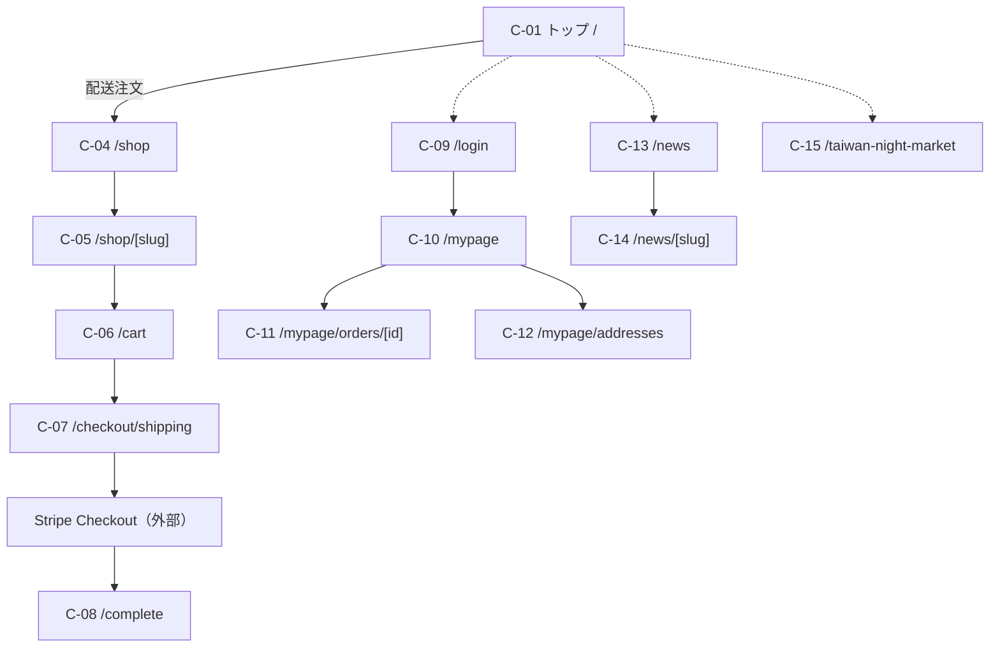
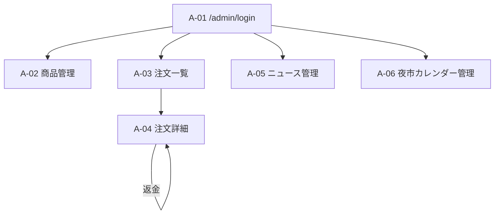

# momo-payment 画面設計書

**対象バージョン**: 本番リリース版（v2.0）
**最終更新**: 2026-06-16
**対象読者**: 発注者・デザイナー・フロントエンド/保守エンジニア

> 本書は全画面の一覧・目的・主な表示/入力項目・遷移・アクセス権限を定義します。実装は `src/app/` 配下。公開画面はすべてロケールプレフィックス付き（`/ja/...`・`/zh-tw/...`）。

---

## 1. 画面一覧

凡例: 権限 — 🌐公開 / 🔑顧客ログイン必須 / 🛠管理者ログイン必須

### 1.1 公開・顧客向け（`/[locale]/...`）

| ID | 画面 | パス | 権限 | 目的 |
|----|------|------|:---:|------|
| C-01 | トップ | `/` | 🌐 | Hero + 配送ECへの導線 |
| C-04 | 配送EC商品一覧 | `/shop` | 🌐 | 商品一覧・カテゴリフィルタ |
| C-05 | 商品詳細 | `/shop/[slug]` | 🌐 | 商品情報・食品表示・バリエーション・カート追加 |
| C-06 | カート | `/cart` | 🌐 | 数量変更・温度帯混在チェック・小計表示 |
| C-07 | 配送チェックアウト | `/checkout/shipping` | 🌐 | 住所・配送日時入力・Stripe 決済 |
| C-08 | 注文完了 | `/complete` | 🌐 | 注文番号・注意事項表示 |
| C-09 | ログイン/新規登録 | `/login` | 🌐 | 顧客認証 |
| C-10 | マイページ（注文履歴） | `/mypage` | 🔑 | 自分の注文一覧 |
| C-11 | 注文詳細 | `/mypage/orders/[id]` | 🔑 | 注文明細・状態 |
| C-12 | 配送先住所管理 | `/mypage/addresses` | 🔑 | 住所 CRUD |
| C-13 | ニュース一覧 | `/news` | 🌐 | お知らせ一覧 |
| C-14 | ニュース詳細 | `/news/[slug]` | 🌐 | お知らせ本文 |
| C-15 | 台湾夜市特設 | `/taiwan-night-market` | 🌐 | 飯舘村台湾夜市案内・カレンダー |
| C-16 | 特定商取引法表記 | `/legal/tokushoho` | 🌐 | 法定表記 |
| C-17 | プライバシーポリシー | `/legal/privacy` | 🌐 | 個人情報の取り扱い |

### 1.2 管理画面（`/admin/...`、ロケールなし）

| ID | 画面 | パス | 権限 | 目的 |
|----|------|------|:---:|------|
| A-01 | 管理者ログイン | `/admin/login` | 🌐 | 管理者認証 |
| A-02 | 商品管理 | `/admin/products` | 🛠 | 商品 CRUD・画像・バリエーション・並び替え |
| A-03 | 注文一覧 | `/admin/orders` | 🛠 | 注文の検索・一覧 |
| A-04 | 注文詳細 | `/admin/orders/[id]` | 🛠 | 発送登録・追跡番号・返金・メール再送 |
| A-05 | ニュース管理 | `/admin/news` | 🛠 | ニュース CRUD・公開制御 |
| A-06 | 夜市カレンダー管理 | `/admin/iitate-calendar` | 🛠 | 開催日・月メモ編集 |

---

## 2. 画面遷移図

### 2.1 顧客フロー

### 2.2 管理者フロー

---

## 3. 画面別 詳細設計

### C-01 トップ（`/`）🌐
- **目的**: 購入導線の起点。
- **表示**: Hero ビジュアル、配送ECへの導線、ニュース抜粋、フッター（法定リンク）。
- **遷移**: → `/shop`（配送）／ `/news` ／ `/taiwan-night-market`。

### C-04 配送EC商品一覧（`/shop`）🌐
- **目的**: 配送対象商品の一覧。
- **表示**: 商品カード（画像・名称・価格）、カテゴリフィルタ（冷凍食品／グッズ）。
- **API**: `GET /api/products`。
- **遷移**: → `/shop/[slug]`。

### C-05 商品詳細（`/shop/[slug]`）🌐
- **目的**: 商品詳細とカート投入。
- **表示**: 画像（複数）、説明、価格、**食品表示**（原材料・アレルゲン・栄養・内容量・期限）、**バリエーション選択**（サイズ）、在庫状況。
- **操作**: 数量選択・カートに追加。
- **遷移**: → `/cart`。

### C-06 カート（`/cart`）🌐
- **目的**: 購入内容の確認。
- **表示**: 明細、数量変更、削除、小計・送料・合計。
- **制約**: **温度帯混在不可**（冷凍とグッズの同梱を警告・ブロック）。
- **遷移**: → `/checkout/shipping`。

### C-07 配送チェックアウト（`/checkout/shipping`）🌐
- **目的**: 配送先・配送日時の入力と決済。
- **入力**: 顧客情報、配送先住所（郵便番号検索による自動入力）、**配送日**・**配送時間帯**（指定なし/午前/12-14/14-16/16-18/18-21）、規約同意。
- **制約**: Stripe 決済必須。
- **API**: `POST /api/orders/shipping` → Stripe Checkout。
- **補足**: 未ログイン時はログイン後にこの画面へ復帰（リダイレクト保持）。

### C-08 注文完了（`/complete`）🌐
- **表示**: 注文番号、ステータス、次のステップ（受取/配送）の注意事項。

### C-09 ログイン/新規登録（`/login`）🌐
- **目的**: 顧客認証。
- **入力**: メール・パスワード（新規登録時はプロフィール/住所も保存）。
- **API**: Supabase Auth ／ `POST /api/auth/signup`。
- **遷移**: → 元画面 or `/mypage`。

### C-10 マイページ・注文履歴（`/mypage`）🔑
- **表示**: 自身の注文一覧（番号・日付・状態・金額）。
- **API**: `GET /api/mypage/orders`。

### C-11 注文詳細（`/mypage/orders/[id]`）🔑
- **表示**: 明細・配送先・ステータス・追跡番号。
- **API**: `GET /api/mypage/orders/[id]`。

### C-12 配送先住所管理（`/mypage/addresses`）🔑
- **操作**: 住所の追加・編集・削除・既定設定。
- **API**: `GET/POST /api/mypage/addresses`、`GET/PUT/DELETE /api/mypage/addresses/[id]`。

### C-13 / C-14 ニュース（`/news`・`/news/[slug]`）🌐
- **表示**: 公開済みお知らせの一覧・本文（Markdown 描画、サニタイズ済み）。
- **API**: `GET /api/news`。

### C-15 台湾夜市特設（`/taiwan-night-market`）🌐
- **表示**: 飯舘村台湾夜市の案内・開催カレンダー（昼/夜/休/ステージ）・月メモ。
- **API**: `GET /api/iitate-calendar`。

### C-16 / C-17 法定ページ 🌐
- **特商法**（`/legal/tokushoho`）・**プライバシーポリシー**（`/legal/privacy`）の静的表示。

---

### A-01 管理者ログイン（`/admin/login`）🌐
- **入力**: メール・パスワード（Supabase Auth）。`admin_users` 登録者のみ通過。
- **補足**: 未認証で `/admin/*` にアクセスすると middleware が本画面へリダイレクト。

### A-02 商品管理（`/admin/products`）🛠
- **操作**: 商品一覧、作成/編集/削除、画像アップロード、バリエーション（サイズ別価格/在庫）、多言語（日本語/繁体字）、公開/非公開、在庫、表示順の並び替え。
- **API**: `CRUD /api/admin/products`、`/api/admin/products/reorder`、`/api/admin/upload`。

### A-03 注文一覧（`/admin/orders`）🛠
- **表示**: 注文の検索・一覧（番号・顧客・種別・状態・金額・日付）。
- **API**: `GET /api/admin/orders`。

### A-04 注文詳細（`/admin/orders/[id]`）🛠
- **表示**: 明細・顧客・配送先・決済・ステータス履歴。
- **操作**: **発送登録**（配送業者・追跡番号 `→SHIPPED`、発送通知メール送信）、**返金**、**メール再送**。
- **API**: `GET /api/admin/orders/[id]`、`/ship`。

### A-05 ニュース管理（`/admin/news`）🛠
- **操作**: ニュース CRUD、公開/非公開、多言語。
- **API**: `CRUD /api/admin/news`。

### A-06 夜市カレンダー管理（`/admin/iitate-calendar`）🛠
- **操作**: 日付ごとの種別（昼/夜/休/ステージ）設定、月メモ編集。
- **API**: `POST /api/admin/iitate-calendar/month-notes` ほか。

---

## 4. 共通仕様

| 項目 | 内容 |
|-----|------|
| レスポンシブ | PC / スマホ対応（MUI + Tailwind） |
| 多言語 | 全公開画面で `ja` / `zh-tw` 切替。URL にロケールプレフィックス |
| フォント | `ja`→Noto Sans/Serif JP、`zh-tw`→Noto Sans/Serif TC（ロケール別動的切替） |
| 認証ガード | `/mypage/*`・`/checkout/*` は要顧客セッション、`/admin/*`（login 除く）は要管理者セッション |
| エラー表示 | フォームバリデーションはインライン表示、API エラーは共通形式（`ok:false`） |
| SEO | 公開ページに `generateMetadata` + JSON-LD 構造化データ |
| アクセシビリティ | 見出し階層（h1 等）・代替テキストを考慮 |

---

## 5. 関連ドキュメント

| ドキュメント | 内容 |
|-------------|------|
| `docs/REQUIREMENTS.md` | 要件定義書（画面遷移図サマリ） |
| `docs/FEATURE_LIST.md` | 機能一覧 |
| `docs/SYSTEM_ARCHITECTURE.md` | システム構成図 |
| `docs/DATABASE_DESIGN.md` | DB設計書 |
