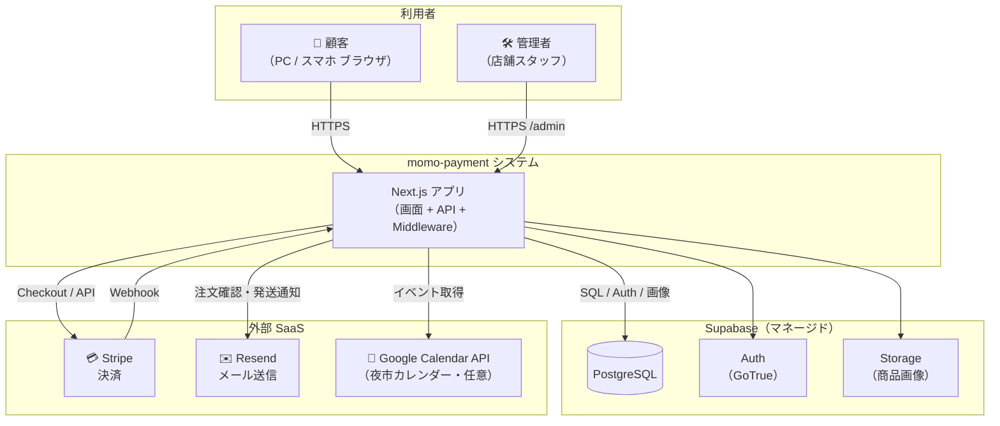
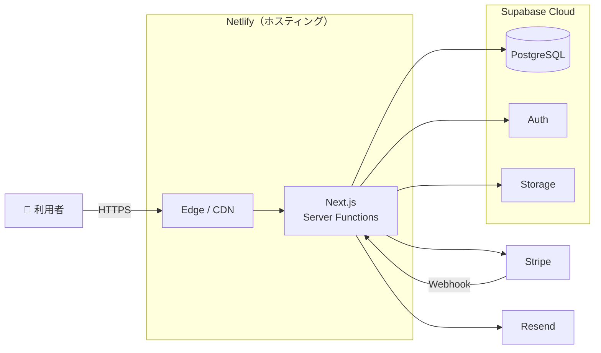
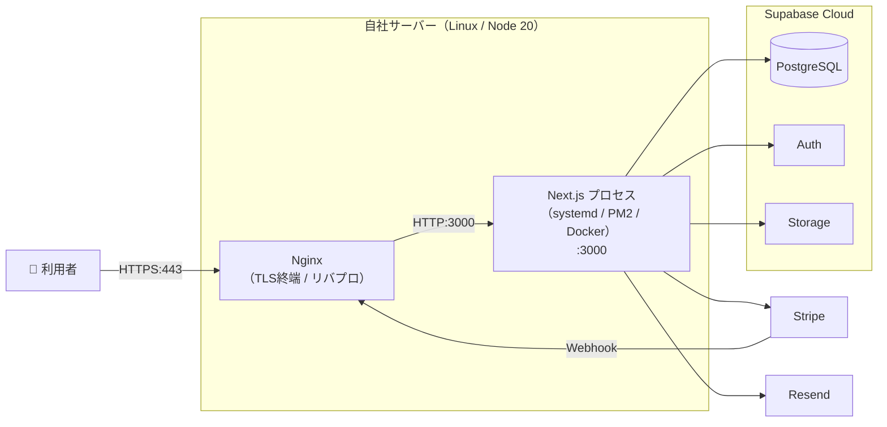
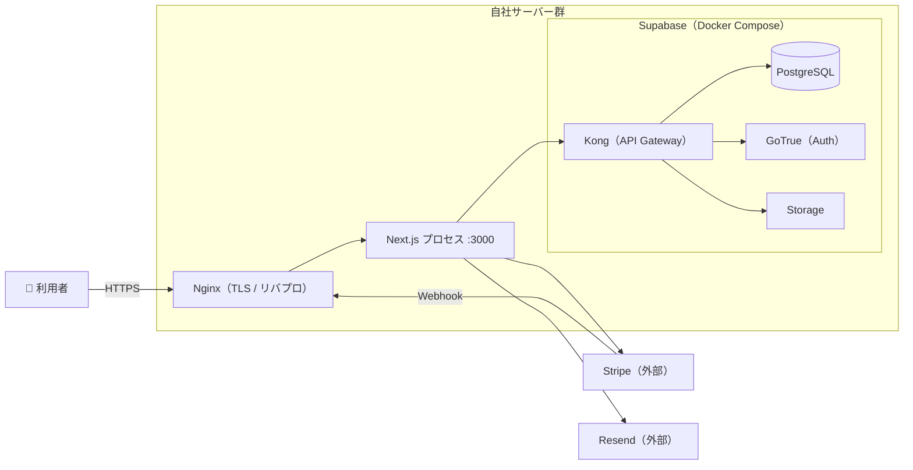
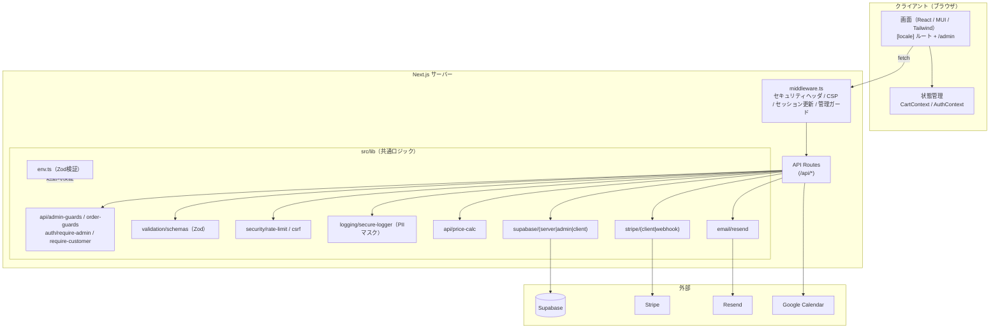
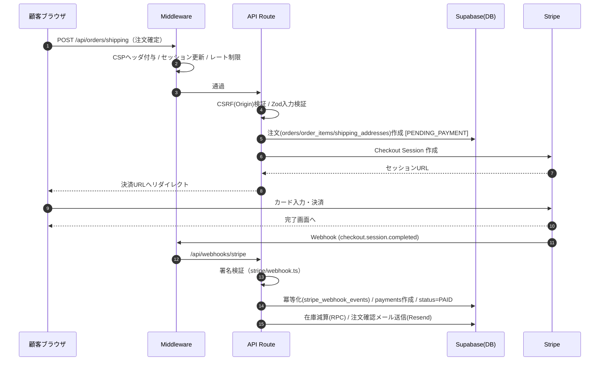
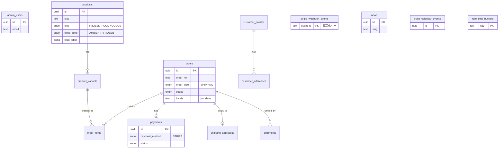
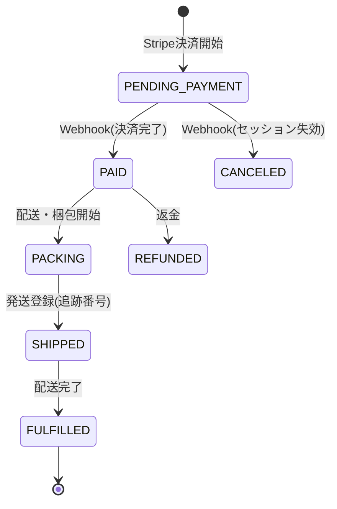
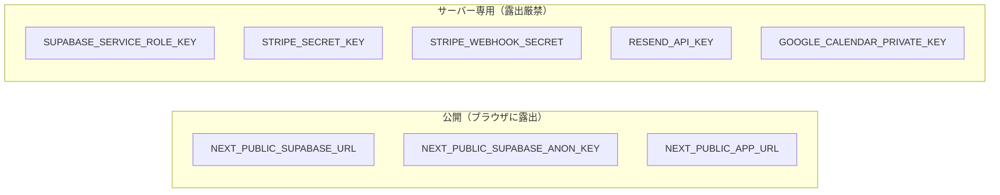

# momo-payment システム構成図（清書版）

**対象バージョン**: 本番リリース版（Next.js 15 / App Router）
**最終更新**: 2026-06-16
**注記**: 図は [Mermaid](https://mermaid.js.org/) 記法。GitHub / VS Code（Markdown Preview Mermaid）/ Mermaid Live Editor 等でレンダリング表示されます。

---

## 1. システムコンテキスト図

システム全体と、利用者・外部サービスの関係を示します。

---

## 2. デプロイトポロジ

### 2.1 現状構成（マネージド / Netlify）

### 2.2 自社サーバー構成（パターン A: Web アプリのみ自社 + Supabase マネージド継続）

### 2.3 フルセルフホスト構成（パターン B: Supabase も自社）

---

## 3. アプリケーション内部構成（コンポーネント図）

---

## 4. リクエスト処理フロー（注文〜決済）

配送 EC の Stripe 決済を例にした主要シーケンスです。

---

## 5. データモデル（ER 概要）

> 完全なテーブル定義・制約・RLS ポリシーは `docs/TECHNICAL.md`「7. DBスキーマ」および `supabase/migrations/`（00001〜）を参照。

### 主なテーブル一覧

| 分類 | テーブル |
|-----|---------|
| 認証・管理 | `admin_users` |
| 商品 | `products` / `product_variants` |
| 注文 | `orders` / `order_items` / `shipping_addresses` / `shipments` / `payments` |
| 顧客 | `customer_profiles` / `customer_addresses` |
| 決済連携 | `stripe_webhook_events`（`square_webhook_events` は旧仕様の名残） |
| コンテンツ | `news` |
| 夜市カレンダー | `iitate_calendar_events` / `iitate_calendar_month_notes` |
| インフラ | `rate_limit_buckets` |

---

## 6. ステータス遷移

- **配送（Stripe）**: `PENDING_PAYMENT → PAID → PACKING → SHIPPED → FULFILLED`
- **キャンセル（決済前）**: `PENDING_PAYMENT → CANCELED`
- **返金**: `PAID 以降 → REFUNDED`

---

## 7. 技術スタック

| レイヤー | 採用技術 | バージョン |
|---------|---------|-----------|
| 言語 | TypeScript | 5.x |
| フレームワーク | Next.js（App Router） | 15.x |
| UI ライブラリ | React | 19.x |
| UI コンポーネント | MUI（Material UI） | 7.x |
| スタイリング | Tailwind CSS | 4.x |
| 国際化 | next-intl（`ja` / `zh-tw`） | 4.x |
| バリデーション | Zod | 4.x |
| DB / 認証 / ストレージ | Supabase（PostgreSQL 15+） | — |
| 決済 | Stripe SDK（API `2025-12-15.clover`） | 20.x |
| メール | Resend | 6.x |
| カレンダー連携 | google-auth-library | 10.x |
| テスト | Vitest（13ファイル / 133件） | 4.x |
| ランタイム | Node.js | 20 LTS |
| ホスティング（現状） | Netlify（`@netlify/plugin-nextjs`） | — |

---

## 8. セキュリティ境界

**多層防御の要点**

| 対策 | 実装 |
|-----|------|
| 環境変数検証 | `src/lib/env.ts`（Zod・起動時） |
| 入力バリデーション | `src/lib/validation/schemas.ts`（Zod） |
| CSRF 保護 | `src/lib/security/csrf.ts`（Origin/Referer 検証） |
| レート制限 | `src/lib/security/rate-limit.ts`（10req/min/IP・インメモリ） |
| セキュリティヘッダ / CSP | `next.config.ts` + `src/middleware.ts`（per-request nonce） |
| PII マスクログ | `src/lib/logging/secure-logger.ts` |
| Webhook 署名検証 | `src/lib/stripe/webhook.ts` |
| RLS | `supabase/migrations/00011_*` 他 |
| 管理者ガード | `src/lib/auth/require-admin.ts` + middleware |
| 個人情報レスポンスの no-store | `src/middleware.ts`（`/api/mypage` 等） |

---

## 9. 関連ドキュメント

| ドキュメント | 内容 |
|-------------|------|
| `docs/DEPLOYMENT_SELF_HOSTED.md` | 自社サーバー向けデプロイ手順書 |
| `docs/OPERATIONS_MANUAL.md` | 運用マニュアル |
| `docs/TECHNICAL.md` | 技術ドキュメント（API・DB・セキュリティ詳細） |
| `docs/REQUIREMENTS.md` | 要件定義書 |
